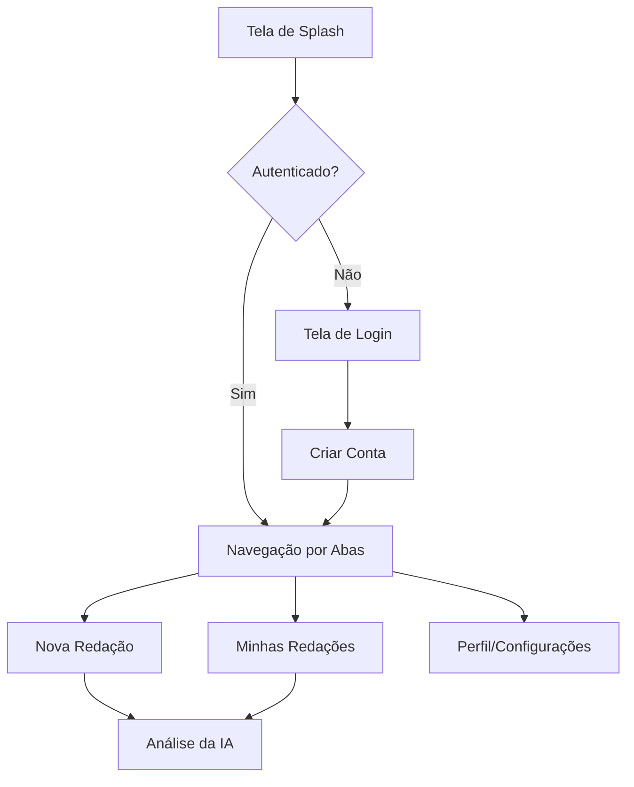

# Atena App

Atena é um assistente pessoal de redação alimentado por IA, desenvolvido para ajudar estudantes a aprimorarem suas habilidades de escrita para o ENEM e outros vestibulares. O aplicativo oferece feedback instantâneo sobre coesão, coerência, gramática e estrutura.

> [!NOTE]
> **Versão Atual**: Text-Focus. Nesta versão, priorizamos a entrada de texto direta para garantir máxima precisão no feedback da IA.

---


## Funcionalidades

- **Correção Inteligente**: Análise detalhada baseada nas competências do ENEM.
- **Histórico de Redações**: Acompanhe sua evolução ao longo do tempo.
- **Interface Moderna**: Design dark mode premium e minimalista.
- **Feedback Detalhado**: Dicas específicas para cada parágrafo do seu texto.

---

## Arquitetura do Sistema

O Atena foi construído utilizando as tecnologias mais modernas do ecossistema mobile.

### Fluxo de Navegação



### Tecnologias Utilizadas

- **Core**: [React Native](https://reactnative.dev/)
- **Framework**: [Expo](https://expo.dev/)
- **Roteamento**: [Expo Router](https://docs.expo.dev/router/introduction/) (Tipo: File-based)
- **Estado Local**: React Hooks (useState, useEffect)
- **Persistência**: AsyncStorage
- **Estilização**: StyleSheet (Vanilla CSS-in-JS)

---

## Como Começar

### Pré-requisitos

- Node.js (v18 ou superior)
- npm ou yarn
- Expo Go (no seu dispositivo móvel)

### Instalação

1. Clone o repositório:
   ```bash
   git clone https://github.com/seu-usuario/atena.git
   ```

2. Instale as dependências:
   ```bash
   npm install
   ```

3. Inicie o servidor de desenvolvimento:
   ```bash
   npx expo start
   ```

---

## Estrutura de Pastas

```text
atena/
├── app/                # Rotas e telas (Expo Router)
│   ├── (routes)/       # Sub-rotas dinâmicas
│   │   ├── (tabs)/     # Navegação por abas
│   │   └── ...         # Telas de login/registro
│   └── _layout.tsx     # Configuração global da UI
├── assets/             # Imagens, fontes e screenshots
├── components/         # Componentes React reutilizáveis
├── constants/          # Cores, temas e dimensões
└── utils/              # Funções auxiliares e mocks
```

---

## Contribuindo

Sinta-se à vontade para abrir issues ou enviar pull requests. Para mudanças maiores, por favor, abra uma issue primeiro para discutir o que você gostaria de mudar.

---

## Licença

Este projeto está sob a licença MIT. Veja o arquivo [LICENSE](LICENSE) para mais detalhes.

---

Feito com dedicacao pela equipe Atena.

